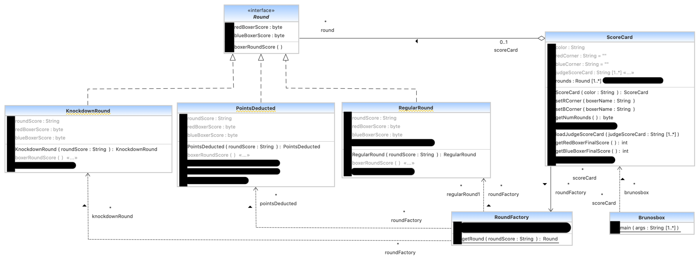

Frank Bruno's Boxing
====================  
### Examen Programación Java 1º DAM - IES de Teis, Vigo.

## En el ring

### ¿Cómo se puntua un combate de boxeo?

En un combate de boxeo, hay tres jueces/zas sentados al lado del ring.

Cada uno de ellos/as rellena una tarjeta de puntos. En este caso: blanca, azul y rosa.

El actual sistema de puntuación del boxeo se conoce como "Sistema obligatorio de 10 puntos". 

Esta es una descripción general básica de cómo funciona:

- Los jueces califican cada asalto en una escala de 10 puntos. La mayoría de asaltos se califican `10-9`, con el boxeador/a que lo hizo mejor puntuando `10` y "ganando" el asalto, y el otro boxeador/a puntuando `9`.
- Si un boxeador es derribado o lastimado lo suficiente como para que el árbitro cuente de pie, ese boxeador pierde un punto. Si un púgil domina un asalto, controla y lanza mejores golpes en todo momento y derriba a su oponente, el resultado final del asalto es `10-8`.
- El /la árbitro puede indicar a los tres jueces/zas que resten un punto a un púgil en cualquier asalto. Lo harán si éste ha hecho algo para romper las reglas, como una falta intencionada (un golpe bajo, un cabezazo o, el favorito de Mike Tyson, morder la oreja de un oponente).

## Salida de la aplicación

Intenta que la salida del programa por CLI sea lo más parecida posible a las imágenes que se proporcionan. Cada una de ellas se corresponde con una de las historias de usuario que se detallan en el script principal `Brunosbox.java`.

## Historias de usuario /casos de uso

Las historias de usuario están enunciadas en el script principal `Brunosbox.java`.

Copia y pega la función principal `Brunosbox.java`. Utilízala como guía en el proceso TDD. **Modifica su código sólo en las líneas que se indiquen**. Sí puedes comentar aquellas partes que aun no hayas implementado.

## Diagrama de clases UML / Arquitectura de la app.

Sigue el diagrama de clase UML proporcionado para construir la aplicación.
Si añades algún componente, dibújalo sobre el diagrama.

## Prepara el proyecto

 1. Crea un nuevo repo PRIVADO en tu cuenta en **Github** y compártelo con el usuario dfleta.
 2. Crea un nuevo directorio en tu equipo y **clona el repositorio** de Github.
 3. Abre VSCode /Eclipse /Netbeans /IntelIJ y **establece como workspace** el directorio que has clonado.
 4. Crea un proyecto **Gradle** o **Maven**.
 5. Pon el proyecto en seguimiento en **Git** y configura `.gitignore`.
 6. Copia y pega la función principal `Brunosbox.java`. Utilízala como guía en el proceso TDD. **Modifica su código sólo en las líneas que se indiquen**. Sí puedes comentar aquellas partes que aun no hayas implementado.
 7. Completa las clases que aquí se indican **implementando los casos test que necesites**. Practica **TDD**.
 8. **Realiza `commits` como mínimo cada vez que termines una historia de usuario**. Sin commit periódicos, no corrijo el examen.

 ## Cómo entregar el código

 1. Crea un repo PRIVADO en tu GitHub y compártelo con el usuario `dfleta`.
 2. **Realiza commits periódicamente** mientras avanzas en el desarrollo de la aplicación. Sin commit periódicos, no corrijo el examen.
 3. Realiza un `push` al repo remoto en GitHub **SOLO cuando hayas terminado el proyecto**.
 4. Si quieres, si vas a dormir mejor, desde Eclipse /Netbeans /IntelIJ exporta el proyecto a un fichero. En VSCode, comprime en un ZIP la carpeta del proyecto. Envíame el archivo ZIP por correo electrónico. **No se admiten ficheros .rar**.

